# CUBE to ICC 转换器 (CUBE to ICC Converter)

这是一个强大的 Python 工具，专为摄影师和后期制作人员设计，用于将 `.cube` 格式的 3D LUT 文件转换为 ICC 配置文件 (.icc/.icm)。

它不仅仅是简单的格式转换，更包含完整的色彩管理流程。通过引入色彩科学（Colour Science），它能够精确处理不同相机的对数曲线（Log Curves）和色域（Gamuts），并将 LUT 的色彩风格准确地“注入”到现有的相机 ICC 配置文件中。

这对于希望在 **Capture One** 等支持 ICC 但不直接支持 3D LUT 的软件中使用视频风格 LUT（如电影感胶片模拟）的用户非常有用。

## ✨ 主要功能

*   **专业的 3D LUT 支持**：读取并解析标准 `.cube` 文件，自动重采样至 ICC 标准所需的 33x33x33 精度。
*   **完整的色彩转换链路**：
    *   准确模拟从“相机原始 RGB”到“目标 Log 色彩空间”的转换。
    *   支持应用 3D LUT 进行色彩映射。
    *   最终转换为 ICC 标准的 Lab 空间。
*   **基础 ICC 继承 (Base Profile Injection)**：
    *   能够读取现有的相机 ICC 配置文件（例如 Capture One 自带的相机 Profile）。
    *   保留原厂优秀的线性化和基础校准数据。
    *   仅替换色彩渲染部分（`A2B0` Tag），确保肤色和影调的自然过渡。
    *   支持复用 Capture One 的胶片标准曲线，或选择线性响应手动设置曝光曲线。
*   **内置 Log 预设**：一键适配常用电影机/相机的 Log 模式：
    *   Sony S-Log3 / S-Gamut3.Cine
    *   Fujifilm F-Log / F-Log2
    *   Panasonic V-Log
    *   ARRI LogC3 / LogC4
*   **高质量插值**：使用 Numpy 实现三线性插值（Trilinear Interpolation），确保色彩转换的平滑性。

## 📸 效果示例 (Examples)

示例中的 3D LUT来自我的另一个项目 [3dlut-creator](https://github.com/bjzhou/3dlut-creator)

|                                                                |                                                             |                                                                   |
|:--------------------------------------------------------------:|:-----------------------------------------------------------:|:-----------------------------------------------------------------:|
|    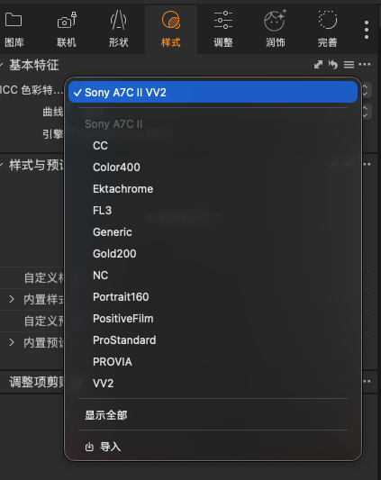<br>**Screenshots**    |        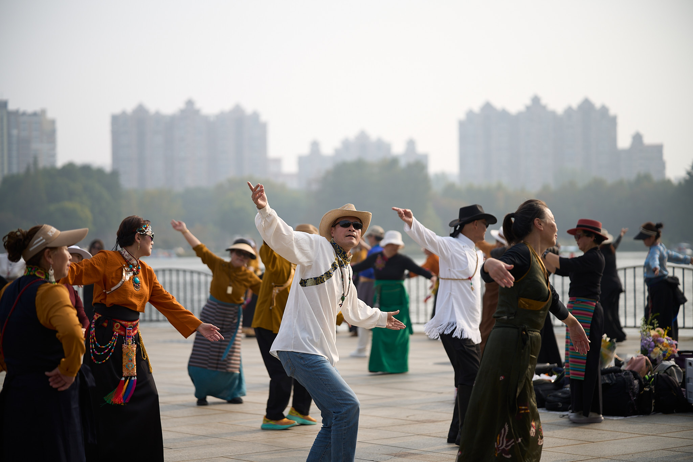<br>**Original**        | 
|              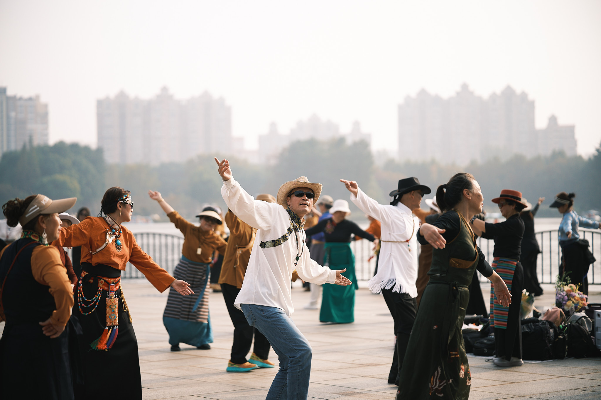<br>**NC**               |             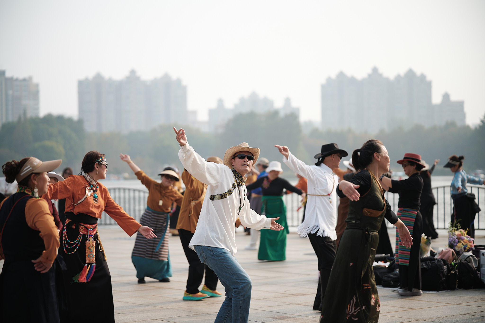<br>**CC**             |          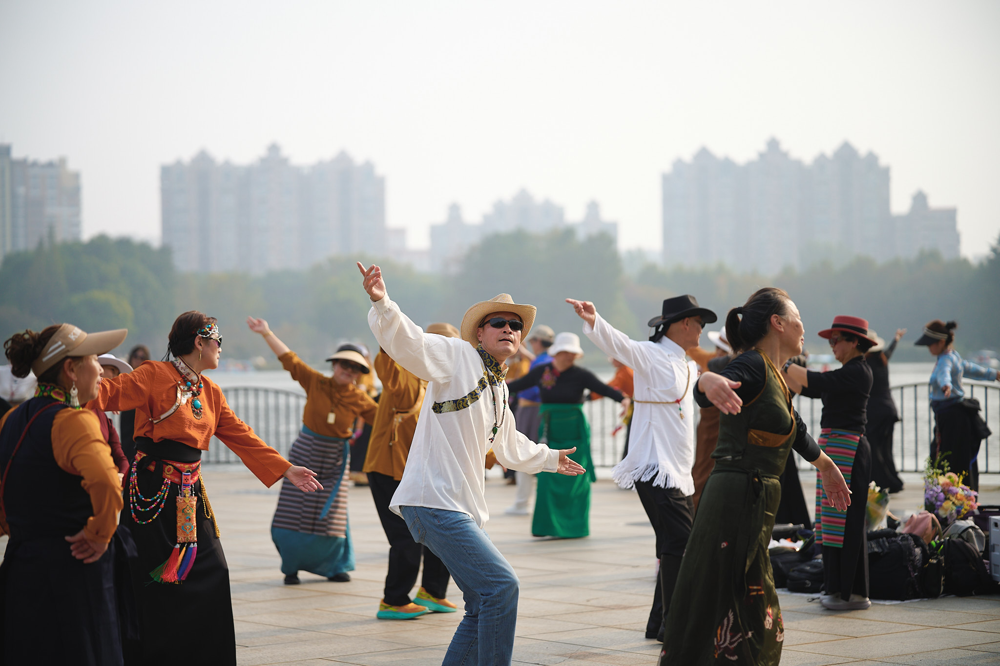<br>**PROVIA**          |
|             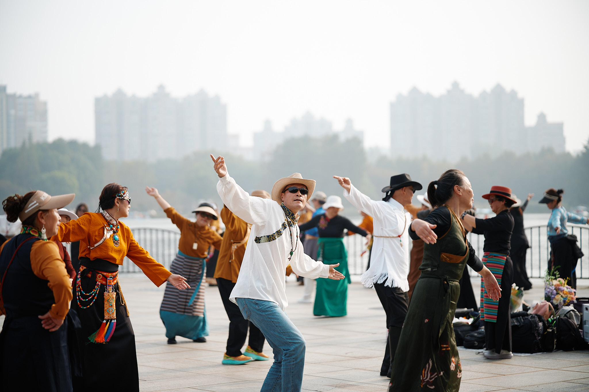<br>**FL3**             |           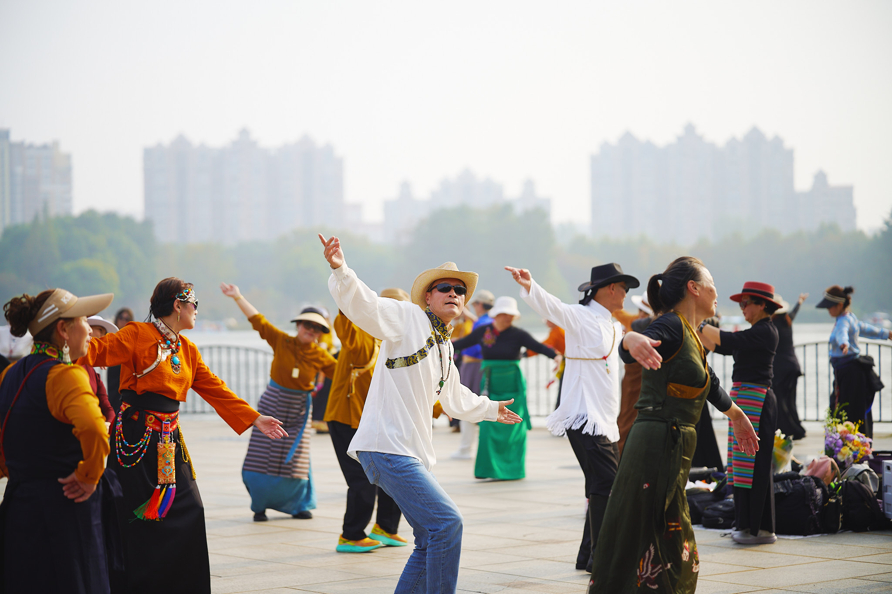<br>**VV2**            | 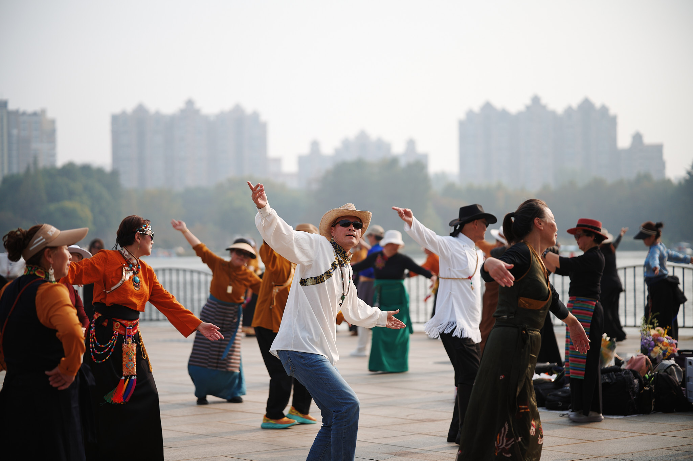<br>**PositiveFilm** |
| 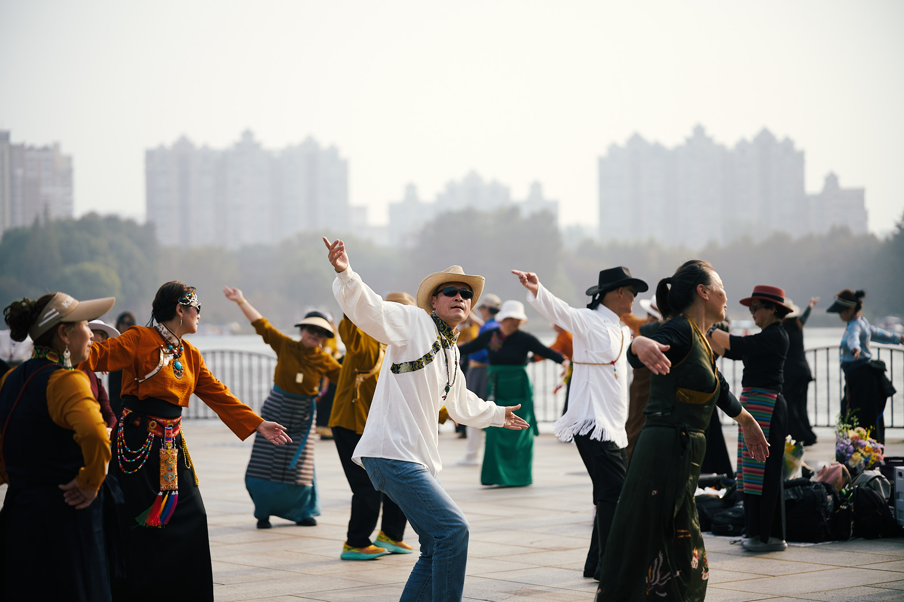<br>**Portrait160** | 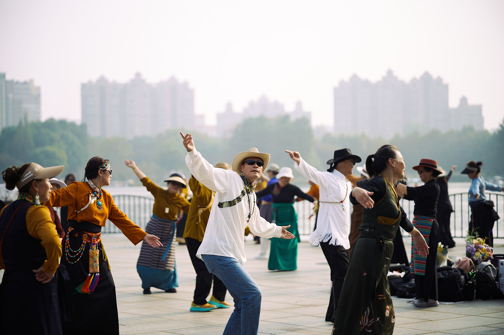<br>**Ektachrome** |        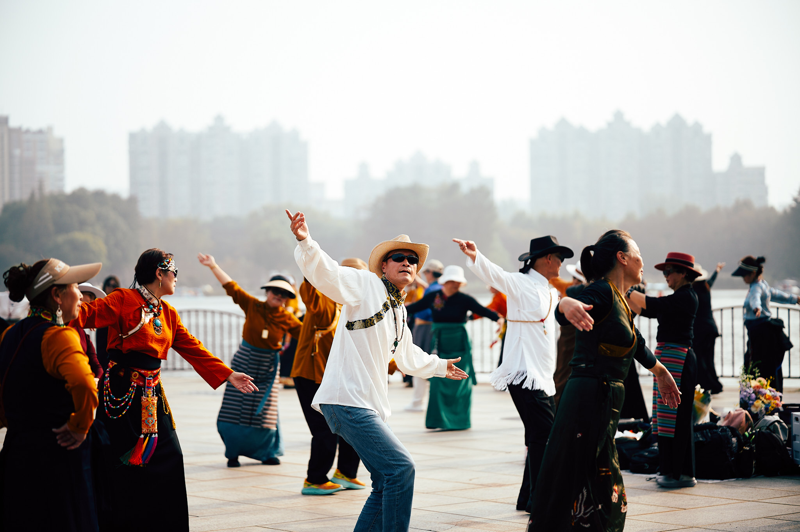<br>**Gold200**         |

## 🛠️ 依赖库 (Dependencies)

本项目依赖以下 Python 库：

*   `numpy`: 数值计算
*   `pillow` (PIL): 图像处理和 ICC 基础操作
*   `colour-science`: 专业的色彩科学计算库

## 📦 安装 (Installation)

确保你已经安装了 Python 3。然后可以通过 pip 安装所需依赖：

```bash
pip install numpy pillow colour-science
```

如果你使用 `uv` 包管理器（推荐）：

```bash
uv sync
```


## 🚀 使用方法 (Usage)

### 图形界面 (GUI)

对于不习惯命令行的用户，可以使用图形界面工具：

```bash
python gui.py
```

*注意：需要系统安装了 `tkinter` 支持（通常 Python 自带）。*

### 打包应用 (Packaging)

如果你想将应用打包成独立的可执行文件（无需安装 Python 环境即可运行），可以使用项目提供的脚本：

**macOS:**
```bash
./build_mac_app.sh
```
生成的文件位于 `dist/Cube2ICC.app`。

**Windows:**
直接双击运行 `build_win_app.bat`。
生成的文件位于 `dist/Cube2ICC/Cube2ICC.exe`。

*注意：打包依赖 `pyinstaller`，请确保已安装：`pip install pyinstaller` 或 `uv add --dev pyinstaller`。*


### 命令行 (CLI)

基本命令行格式：

```bash
python main.py input_cube_file [options]
```

[How do I install and import my own color profiles?](https://support.captureone.com/hc/en-us/articles/360002409057-How-do-I-install-and-import-my-own-color-profiles)

### 参数说明

| 参数 | 说明 | 默认值 |
| :--- | :--- | :--- |
| `input_cube` | **(必选)** 输入的 `.cube` 文件路径 | - |
| `--preset` | **(推荐)** 快速预设，自动设置 Gamut 和 Curve | 无 (可选: `F-Log2`, `F-Log`, `V-Log`, `S-Log3`, `LogC3`, `LogC4`) |
| `--base-icc` | 基础 ICC 文件路径 (建议指定相机对应的原始 ICC) | (代码内置默认路径) |
| `--target-gamut` | LUT 设计时预期的输入色域 | `sRGB` |
| `--target-curve` | LUT 设计时预期的输入曲线 (OETF) | `sRGB` |
| `--lut-output-gamut` | LUT 输出的色彩空间 | `sRGB` |
| `--lut-output-curve` | LUT 输出的 Gamma 曲线 | `sRGB` |
| `--gamma` | 中间调亮度校正 (Gamma > 1 提亮, < 1 压暗) | `1.0` (默认不校正) |

### 示例

#### 1. 转换 S-Log3 风格的 LUT
假设你有一个专为 Sony S-Log3 设计的胶片模拟 LUT (`MyFilmLook.cube`)，并且你想把它应用到 Capture One 的 Sony A7M4 配置文件上。

```bash
python main.py MyFilmLook.cube \
  --preset S-Log3 \
  --base-icc "/Applications/Capture One.app/.../SonyA7M4-Generic.icm"
```
*程序会自动生成名为 `SonyA7M4-MyFilmLook.icc` 的新文件。*

#### 2. 转换标准 sRGB LUT
如果你有一个通用的摄影 LUT（设计给标准 Rec.709/sRGB 图片使用的）：

```bash
python main.py standard_style.cube --base-icc "path/to/base.icm"
```
*不指定 preset 或 target 参数时，默认视为 sRGB。*

#### 3. 高级自定义
手动指定非标准的色彩空间组合：

```bash
python main.py custom_look.cube \
  --target-gamut "Alexa Wide Gamut" \
  --target-curve "LogC3" \
  --base-icc "path/to/arri_base.icm"
```

## ⚙️ 工作原理 (How it works)

本脚本通过以下步骤生成 ICC 配置文件：

1.  **解析基础 ICC**：读取 `--base-icc` 指定的文件，获取相机的原始 RGB 到 PCS (Profile Connection Space) 的转换关系。
2.  **构建虚拟成像链路**：
    *   **Input**: 生成标准网格点 (Camera RGB)。
    *   **To sRGB**: 利用 ImageCms 将 Camera RGB 转换为标准 sRGB。
    *   **To Log**: 利用 `colour-science` 将线性 sRGB 转换为目标 Log 空间（如 S-Log3），模拟相机拍摄 Log 素材的状态。
    *   **Apply LUT**: 在 Log 空间上应用 3D LUT，获得风格化后的色彩。
    *   **To Lab**: 将风格化后的色彩最终转换为 ICC 标准的 Lab 空间 (D50)。
3.  **封装 ICC**: 将计算好的 "Camera RGB -> Lab" 映射表打包写入 ICC 文件的 `A2B0` (Perceptual/Colorimetric) 标签中，生成最终文件。
